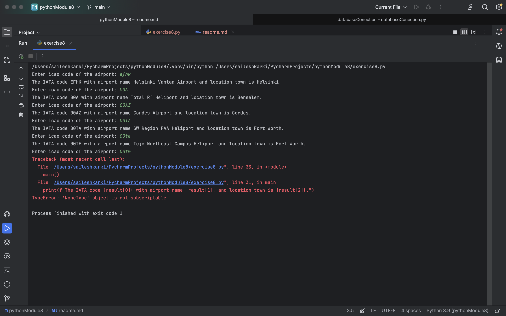

# Python Module 8: Using relational databases exercises results.
## Task8.1 :
    "select name,municipality from airport where ident = %s"

## Task8.2 :
    "select type,Count(*) as airport_count from airport where iso_country = %s group by type order by type"

##Task8.3
    "select latitude_deg,longitude_deg from airport where ident = %s"
